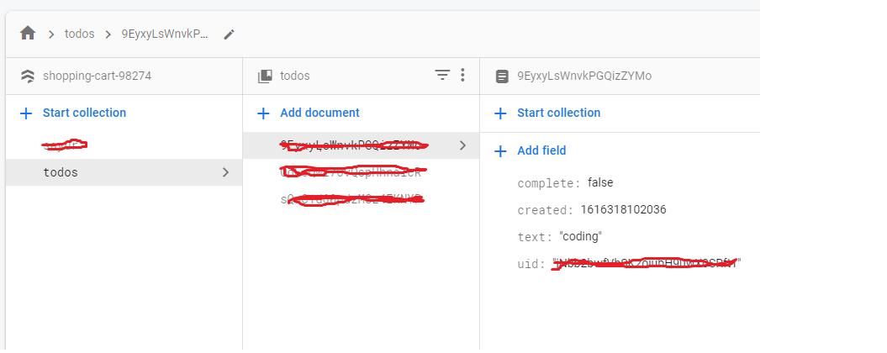

# Realtime Todo App 🔥

⚡ todo list app using Svelte JS with firebase store & auth ⚡


## Setup Firebase & Environment

- Create Firebase Project
- Create Firestore database `todos`  
  
- Change Rules to this :
  
- Add new Index Composite to run Query, like this
  
- Enable Google Sign-in Method
  
- Copy Firebase Config into new file `.env` adjust with `.env-example`
  


## Install & Running

Install

```bash
npm install
```

Running

```bash
npm run dev
```

